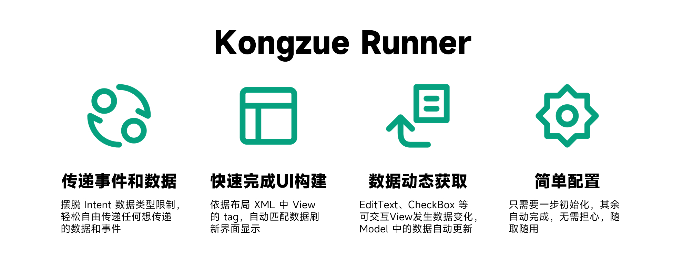

# Kongzue 的消息总线

Kongzue Runner 旨在快速完成 App 逻辑构建，协助开发者低成本完成业务开发。

Runner 提供一个独立的消息事件传递总线，不依赖 Intent，可以独立传递数据、执行事件，亦可以对尚未运行的 Activity 预设需要执行的事件，或者跨界面预设接下来要执行的事件。

还提供一套近乎全自动化的 ViewModel 框架，能够依据数据和 View 的对应关系自动实现数据绑定和界面适配（Beta）。



## 优势

- 操作简单易上手；

- 不需要重写任何接口，无需繁琐的设置，不需要你做任何继承或者重写接口；

- 可以对一个不存在，还没启动的 Activity 也能生效；

- 跨类操作直接对内部成员赋值；

- 自动化，默认主线程执行，操作 UI 更方便；

- 直接丢就完事了，这货就是个挂；

## 引入

<div>
<b>最新版本：</b>
<a href="https://jitpack.io/#kongzue/Runner">

</a> 
</div>


1) 在 project 的 build.gradle 文件中找到 `allprojects{}` 代码块添加以下代码：

```
allprojects {
    repositories {
        google()
        jcenter()
        maven { url 'https://jitpack.io' }      //增加 jitPack Maven 仓库
    }
}
```

⚠️请注意，使用 Android Studio 北极狐版本（Arctic Fox）创建的项目，需要您前往 settings.gradle 添加上述 jitpack 仓库配置。

2) 在 app 的 build.gradle 文件中找到 `dependencies{}` 代码块，并在其中加入以下语句：

```
implementation 'com.github.kongzue:Runner:0.0.3'
```


## 怎么丢？

首先你得初始化，建议在 Application#onCreate 里进行：

```java
Runner.init(this);
```

然后就可以愉快的丢东西了！

### 丢事件

在已经实例化的 Activity 上执行操作：

```java
//MainActivity.getInstance() 指向 MainActivity 的实例化对象，此处只做演示用，不建议这样用有内存泄漏的风险
Event.runOnActivity(MainActivity.getInstance(), new ActivityRunnable() {
    @Override
    public void run(Activity activity) {
        //Todo...
    }
});
```

不确定，或尚未实例化的情况下，在指定 Activity 上执行操作（会在实例化之后执行）：

```java
Event.runOnActivity(Activity2.class, new ActivityRunnable() {
    @Override
    public void run(Activity activity) {
        //Todo...
    }
});
```

甚至不知道 class，只有个 Activity 的名字，在指定名字的 Activity 上执行操作（会在实例化之后执行）：

```java
Event.runOnActivity("Activity2", new ActivityRunnable() {
    @Override
    public void run(Activity activity) {
        //Todo...
    }
});
```

额外说明，ActivityRunnable 具有泛型，你可以直接指定泛型为你的目标 Activity，这样就可以直接操作其内部的 public 修饰的成员或方法了：

```java
Event.runOnActivity("Activity2", new ActivityRunnable<Activity2>() {
    @Override
    public void run(Activity2 activity2) {
        activity2.execPublicFunction();
    }
});
```

#### 在回到此界面时执行

除了 runOnActivity 外，还有 runOnResume，此方法与 runOnActivity 的操作基本一致，但它的执行条件是

- 当返回该界面时；

- 当处于该界面时；

即若当前指定界面处于顶层，runOnResume 会立即执行，若处于后台或者非顶层，则当界面恢复到顶层时执行。

### 丢内容

首先，你需要在目标 Activity 上编写一个成员，例如：

```java
Bitmap bitmapResult;
```

对已经实例化的 Activity 中的成员直接赋值：

```java
//activity2 为已经实例化的 Activity2
Data.sendToActivity(activity2, "bitmapResult", BitmapFactory.decodeResource(getResources(),R.mipmap.img_bug));
```

不确定，或尚未实例化的情况下，在指定 Activity 中的成员直接赋值（会在实例化之后执行）：

```java
Data.sendToActivity(Activity2.class, "bitmapResult", BitmapFactory.decodeResource(getResources(),R.mipmap.img_bug));
```

至不知道 class，只有个 Activity 的名字，在指定 Activity 中的成员直接赋值（会在实例化之后执行）：

```java
Data.sendToActivity("Activity2", "bitmapResult", BitmapFactory.decodeResource(getResources(),R.mipmap.img_bug));
```

要是担心混淆导致成员名称发生变化，可以使用注解，在 Activity2 中对成员进行注解标注其接收的 key：

```java
@SenderTarget("bitmapResult")
Bitmap bitmap;
```

### 对于任意类的成员内容更新

比如现在有一个数据存储类 User，请在其构造函数或初始化方法中添加 `Runner.bindAnyObject(object)`，例如：

```java
public class User {
    
    public User() {
        Runner.bindAnyObject(this);
    }
    
    private String name;
    private int age;
    @SenderTarget("avatar")
    private Bitmap bitmap;
    
    //...
}
```

若当前已存在实例化的对象 user，那么可以通过以下代码更新其内容：

```java
Data.sendToAnyObject(user, "name", "ZhangSan");
```

若担心混淆，可使用 `@SenderTarget(...)` 注解标注其接收的 key。

若当前 User 不确定是否实例化，可使用其 Class 或类名来代替设置：

```java
Data.sendToAnyObject(User.class , "name", "ZhangSan");
```

Kongzue Runner 的优势在于，你可以在程序的任何地方指定修改它的值，例如 Demo 中演示了，在 Activity2 中对 MainActivity 中的 user 对象内容进行操作 [查看代码](https://github.com/kongzue/Runner/blob/5c5ae5e235a910e383289d75d517e4318803100c/app/src/main/java/com/kongzue/messagebusdemo/Activity2.java#L131)。

另外，Kongzue Runner 配备了完善的弱引用，您无需担心内存泄漏的问题，若出于项目中存在多个实例化的相同对象的数据操作，建议使用实例化后的对象进行操作，或者在不需要处理其数据时，使用以下方法解绑对象：

```java
Runner.unbindAnyObject(obj);
```

Kongzue Runner 操作数据遵循**栈**的处理方式，即，若存在多个相同类型的对象，使用 Class/className 模式操作时遵循后入栈的优先操作的方式，且不会对所有相同类型对象都进行处理。

## 随时更新 View 的内容

你可以为 View 指定一个注解，当对应 key 的广播执行时，**所有** （包括其他界面）拥有该注解的 View 的内容会被更新。

例如：

```java
@DataWatcher("subscriberA")
private TextView txtSubscribeMessage;
```

发送更新内容通知：

```java
Data.changeData("subscriberA", "Test Message");
```

随时更新会根据 View 组件的类型和数据类型进行匹配，例如当 View 为 TextView 内容为 int 时调用 textview.setText(resId) 去设置内容，此外还支持基本组件：

| View      | 数据类型                                                     |
| --------- | ------------------------------------------------------------ |
| TextView  | String、int（资源id）、CharSequence                          |
| ImageView | Bitmap、int（资源id）、Drawable、Icon、Uri                   |
| ListView  | ListAdapter、List（仅支持执行对应 adapter 的数据更新操作 notifyDataSetChanged） |

此外，你还可以通过注解 `@DataWatchers` 设置订阅多个广播：

```java
@DataWatchers({"subscriberA", "subscriberB"})
private TextView txtSubscribeMessage;
```

#### 根据 View 的 Tag 更新内容

你还可以使用以下代码根据 View 设置的 Tag 来修改内容，对所有界面同 Tag 全部生效。

```java
Data.changeDataByTag("subscriberB", "Hello World");
```

### 对于任意类的 UI 内容更新

对于 Fragment 等无法统一获得管理的 UI 组件，可以使用：

```java
Runner.bindAnyObject(this);
```

对该组件完成绑定，对于 LifecycleOwner 的实现成员，例如 Fragment，会在销毁时自动解绑。

更新成员中的 View 内容：

```java
Data.changeData("subscriberA", "Test Message");
```

要依据 Tag 更新成员内容，请额外为该类实现接口`RootViewInterface`：

```java
public class SettingsFragment extends Fragment implements RootViewInterface {
    
    //rootView 指向您 UI 的根布局，必须为 ViewGroup
    ViewGroup rootView;
    
    @Override
    public View getRootView(){
        return rootView;
    }
    
    @Override
    public View onCreateView(LayoutInflater inflater, @Nullable ViewGroup container, @Nullable Bundle savedInstanceState) {
        Runner.bindAnyObject(this);
        //create view...
        return rootView;
    }
}
```

即可完成绑定，使用以下方法更新 UI 内容：

```java
Data.changeDataByTag("subscriberB", "Hello World");
```

#### 自定义设置器

对于未预设的 View 或者你需要其他方式方法设置 View 的数据更新，可以使用设置自定义数据处理器：

```java
Data.customDataSetter = new CustomDataSetter() {
@Override
public boolean setData(View view, Object data) {
        if (view instanceof CustomView) {
        //自定义设置数据类型
        view.setData((CustomData) data.getData());
        //返回 true 表示让 Runner 不再继续判断处理
        return true;
        }
        return false;
        }
        };
```

## 自动化 ViewModel

Runner 提供 View 和 Model 数据更新的双向绑定，即 Model 中的数据与界面上的 View 绑定，当数据发生变化时界面上的 View 内容自动更新，当界面中存在的可交互控件，例如 EditText、CheckBox，内容或状态发生变化时也将自动同步给 Model 中的内容。

要实现这些功能，首先请确保你的数据字段和 XML 中的 View 配置的 `android:tag` 属性保持一致，例如：

```xml
<?xml version="1.0" encoding="utf-8"?>
<LinearLayout xmlns:android="http://schemas.android.com/apk/res/android"
    xmlns:app="http://schemas.android.com/apk/res-auto"
    xmlns:tools="http://schemas.android.com/tools"
    android:layout_width="match_parent"
    android:layout_height="match_parent"
    tools:context=".Activity3"
    android:orientation="vertical">

    <EditText
        android:tag="username"
        android:layout_width="match_parent"
        android:layout_height="wrap_content"/>

    <EditText
        android:tag="password"
        android:layout_width="match_parent"
        android:layout_height="wrap_content"/>

    <CheckBox
        android:tag="isRememberLogin"
        android:layout_width="match_parent"
        android:layout_height="wrap_content"
        android:text="记住登录状态"/>

</LinearLayout>
```

则 Model 代码为：

```java
public class LoginInfo {
    
    private String username;
    private String password;
    private boolean isRememberLogin;
    
    //省略对应的 get/set 方法...
}
```

此时，在 Activity 中初始化 LoginInfo 后，使用 `@BindModel` 注解标注 LoginInfo ，执行 `ViewModel.bindActivity(this);` 即可绑定界面元素：

```java
public class Activity4 extends AppCompatActivity {
    
    @BindModel
    ListData listData;
    
    @Override
    protected void onCreate(Bundle savedInstanceState) {
        super.onCreate(savedInstanceState);
        setContentView(R.layout.activity_4);
        
        listData = new ListData();
        ViewModel.bindActivity(this);
    }
}
```

要实现数据修改实时对界面更新，需要使 Model 继承 BaseModel 并在 set 方法后执行 `refreshUI();`

### 一点骚操作

对于简单的单布局 ListView 也可实现一键自动适配器，首先使 ListView 继承 `AutoCreateListViewInterface` 并回传子布局：

```java
public class AutoCreateListView extends ListView implements AutoCreateListViewInterface {
    
    public AutoCreateListView(Context context) {
        super(context);
    }
    
    public AutoCreateListView(Context context, AttributeSet attrs) {
        super(context, attrs);
    }
    
    public AutoCreateListView(Context context, AttributeSet attrs, int defStyleAttr) {
        super(context, attrs, defStyleAttr);
    }
    
    @Override
    public int itemLayoutRes() {
        return R.layout.item_list_test;		//回传子布局
    }
}
```

制作数据 Model：

```java
public class ListData {
    
    List<Data> list;
    
    public ListData() {
        list = new ArrayList<>();
        //list.add... 省略数据添加步骤
    }
    
    class Data{
        String title;
        String tip;
    }
}
```

绑定到 Activity：

```java
public class Activity4 extends AppCompatActivity {
    
    @BindModel
    ListData listData;
    
    @Override
    protected void onCreate(Bundle savedInstanceState) {
        super.onCreate(savedInstanceState);
        setContentView(R.layout.activity_4);
        
        listData = new ListData();
        ViewModel.bindActivity(this);
    }
}
```

ViewModel 会自动配置 Adapter，你无需关心任何事情。

## 开源协议

```
Copyright Kongzue Runner

Licensed under the Apache License, Version 2.0 (the "License");
you may not use this file except in compliance with the License.
You may obtain a copy of the License at

http://www.apache.org/licenses/LICENSE-2.0

Unless required by applicable law or agreed to in writing, software
distributed under the License is distributed on an "AS IS" BASIS,
WITHOUT WARRANTIES OR CONDITIONS OF ANY KIND, either express or implied.
See the License for the specific language governing permissions and
limitations under the License.
```